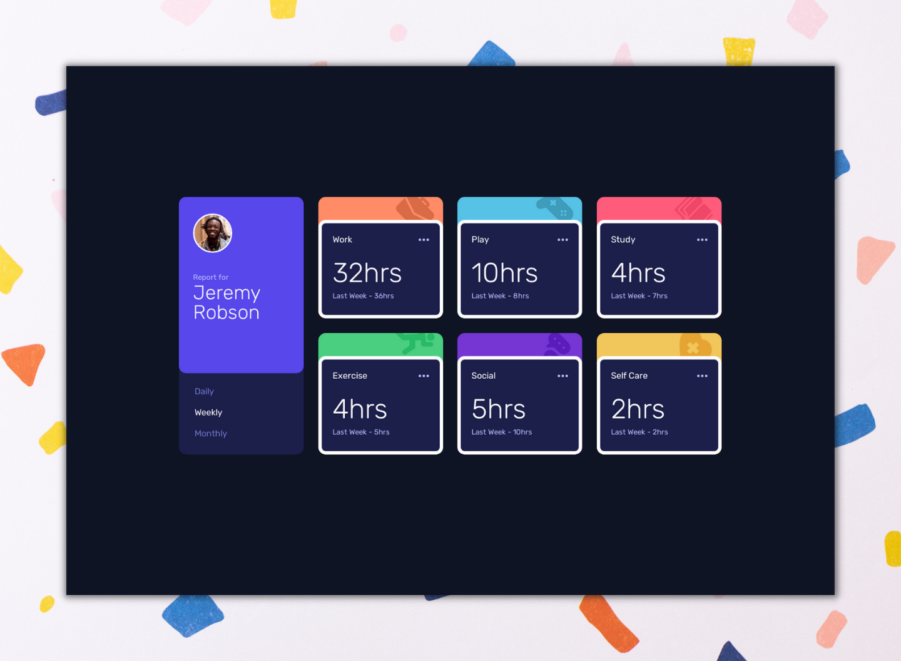

# Time tracking dashboard

> 🔖 This is a solution to the [Time tracking dashboard challenge on Frontend Mentor](https://www.frontendmentor.io/challenges/time-tracking-dashboard-UIQ7167Jw).

## 🌈 ✨ 🎉 Have Fun Building! 🚀 🎊 🎈
> 🖥️ **Welcome** <br>
> Thanks for checking out this front-end coding challenge.
[Frontend Mentor](https://www.frontendmentor.io) challenges help you improve your coding skills by building realistic projects.
***To do this challenge, you need a basic understanding of HTML, CSS and JavaScript.*** Press <kbd>Enter</kbd> 🚀 to start the game!!

## 📍Table of Contents
- [Brief](#brief)
- [The challenge](#the-challenge)
- [Links](#links)
- [My process](#my-process)
- [Built with](#built-with)
- [What I learned](#what-i-learned-)
- [Difficult Things](#difficult-things-)
- [Author](#author)

## Brief
A perfect opportunity to practice your CSS Grid skills. For anyone wanting to take it up a notch, we provide a JSON data file to practice working with data.

This challenge is perfect if you're looking to test your CSS Grid chops. Even without Grid, this project will be a fun one to help you practice your layout skills!
Your challenge is to build out this dashboard and get it looking as close to the design as possible.
You can use any tools you like to help you complete the challenge. So if you've got something you'd like to practice, feel free to give it a go 👍.

If you would like to practice working with JSON data, we provide a local `data.json` file for the activities. This means you'll be able to pull the data from there instead of using the content in the `.html` file.

**Preview** :eyeglasses:



## The challenge 
Users should be able to:
  
| Challenge | Newbie | Junior | Intermediate | Advanced |
| --- | :---: | :---: | :---: | :---: |
| View the optimal layout for the site depending on their device's screen size |  | ⭕ |  |  |
| See hover states for all interactive elements on the page | ⭕ |  |  |  |
| Switch between viewing Daily, Weekly, and Monthly stats |  | ⭕ |  |  |

[](https://www.frontendmentor.io/challenges?difficulties=2)

## Links
- Solution URL: [Here](https://www.frontendmentor.io/solutions/femtimetrackingdashboard-ujF6vcWFM)
- Live Site URL: [Here](https://time-tracking-dashboard-xvferdy.netlify.app/ "Live")

## My process
> ⌛ I challenge my self to finish this for ***~3 days*** <br>
> ▐ <br>
> 🧑‍💻 ***Day 1.*** Folder structure & basic [Sass](https://sass-lang.com/) boilerplate <kbd>~2 hours</kbd> <br>
> ▐ <br>
> 🧑‍💻 ***Day 2.*** [HTML](https://developer.mozilla.org/en-US/docs/Web/HTML) skeleton <kbd>~2.5 hours</kbd> <br>
> ▐ <sub>Plus starting making a very basic layout using `grid` </sub> <br>
> ▐ <br>
> 😭 ***Day 3.*** [Javascript](https://www.javascript.com/) day<br>
> ▐ <sub>Working with JSON file <kbd>~4 hours</kbd></sub> <br>
> ▐ <br>
> 🌐 ***Day 3.*** Submit to [**Frontend Mentor**](https://www.frontendmentor.io/solutions/femtimetrackingdashboard-ujF6vcWFM "Solution") 🚩 <br>
> ▐ <sub>Add some [CSS](https://developer.mozilla.org/en-US/docs/Web/CSS) for coloring <kbd>~3 hours</kbd></sub> <br>
> ▐ <br>
> 🗓️ ***Day 4 - 5.*** Continuing incomplete design <br>
> ▐ <sub>Try to fix buggy style <kbd>~6.5 hours</kbd></sub> <br>
> ▐ <sub>Responsive design <kbd>~3 hours</kbd></sub> <br>
> ▐ <sub>Tried to figuring out how to add animation <kbd>~1 day</kbd></sub> <br>
> ▐ <br>
> 🗓️ 

## Built with
- [React](https://reactjs.org/ "React js")

## What I learned 🥳
Learn how to change background opacity without affecting text. 👉 `rgba($color: #000000, $alpha: 1.0)`

###### src/stylesheets/components/\_card.scss
```scss
&__content {
  margin-top: 21px;
  background: rgba($dark-blue, 1);
  height: 80%;
  width: 100%;
  position: absolute;
  bottom: 0;
  &:hover {
    background: rgba($dark-blue, 0.5);
  }
}
```

## Difficult Things 😵‍💫
Things were difficult for me and I finally gave up 🤙
- [ ] `grid`
- [ ] Mobile view

## Author
| [<br><sub><samp>Berlianto</samp></sub>](https://github.com/xvferdy)  |
|:---:|

<h3 align="right">
      <a href="#time-tracking-dashboard">To Top ✪</a>
</h3>
